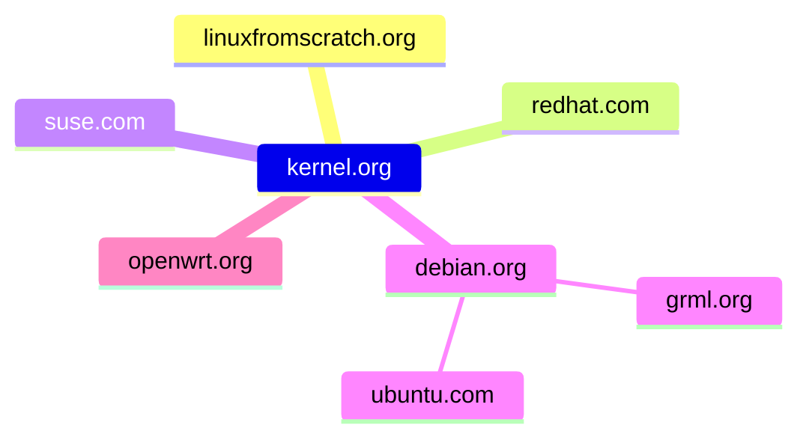

[GitHub](https://github.com/rogernul/temptest/blob/main/h.md?plain=1)
[百度](https://www.baidu.com/)
[哔哩](https://www.bilibili.com/?spm_id_from=333.1007.0.0)
[值买](https://www.smzdm.com/)
[京东](https://www.jd.com/)
[淘宝](https://www.taobao.com/)
[CPU](https://www.cpubenchmark.net/)
[massgrave.dev](https://massgrave.dev/)
[w3school](https://www.w3school.com.cn/html/index.asp)

[Git教程](https://www.runoob.com/git/git-basic-operations.html)
[axel](https://github.com/axel-download-accelerator/axel/releases)
[virt-manager](https://virt-manager.org/)
[Kernel](https://kernel.org/)
[BusyBox](https://www.busybox.net/)
[LFS](https://www.linuxfromscratch.org/lfs/)
[OpenWrt Wiki](https://openwrt.org/supported_devices)
[OpenWrt dld](https://downloads.openwrt.org/)
[Grml](https://grml.org/)
[Arch Linux](https://archlinux.org/)
[Debian](https://www.debian.org/)
[Ubuntu](https://ubuntu.com/)
[Samba](https://www.samba.org/)
